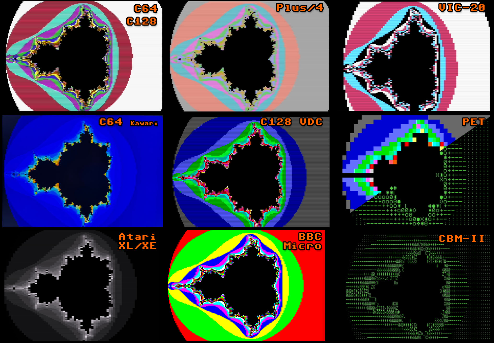
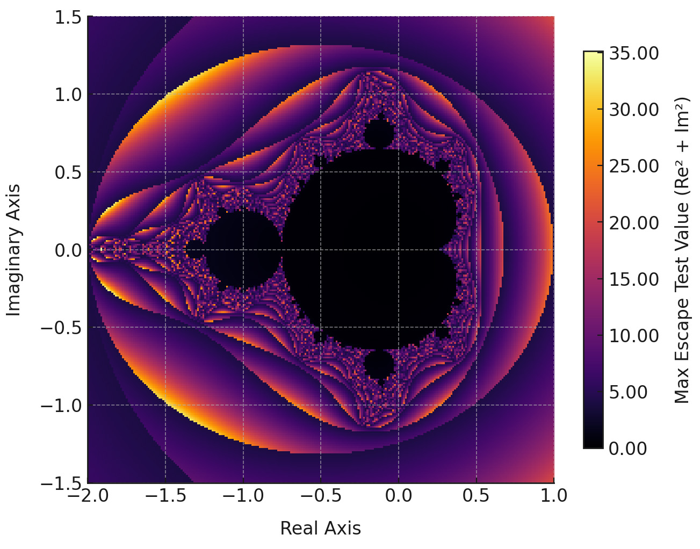

# mandelbr8
## A fast Mandelbrot generator for 8 bit computers, 100% Assembly code.  

Currently supported CPU types:
### 6502
- Commodore 64 (with or without Kawari acceleration).
- Commodore 128 (VIC-IIe and VDC modes).
- Commodore TED machines (Plus/4 and C16 with 64 KB).
- Commodore VIC-20 (16+ KB).
- Commodore PET (8+ KB, with optional color support).
- Commodore CBM-II machines (6xx and 7xx, including the "B128").
- Atari XL/XE (64 KB).
- BBC Micro B (32 KB).

[more soon]

### Z80
[soon]

### 6809/6309
[soon]

### TMS9900
That's not a 8-bit machine :-)
Look here: https://github.com/0x444454/mandel99

# CONTROLS

The app is simply controlled using a joystick:
- C64/C128: Joystick port 2.
- TED machines: Joystick port 1.
- PET and CBM-II machines: WASD for directions and SHIFT for fire button.
- Atari XL/XE: Joystick port 1.
- BBC Micro: Analog joystick port 1 (untested), or cursor keys + shift.

Actions:
- Up, Down, Left, Right: Move around in complex plane.
- Fire + Up: Zoom in.
- Fire + Down: Zoom out.
- Fire + Right: Increment max iterations (upper limit of 255).
- Fire + Left: Decrement max iterations (lower limit of 1).

Note: Zooming in over the precision limit can cause a solid color screen to be rendered. In that case, zoom out until you see the image rendered correctly again.

# SUPPORTED RESOLUTIONS

### C64, C128 40 column mode, TED machines
- First pass: 40x25, 16 colors
- Second pass: 160x200, 16 colors (multicolor bitmap)

Note: Kawari 320x200 high resolution is not yet supported (work in progress).

### C128 80 column mode:
- First pass: 80x50, 16 colors
- Second pass: 640x200, 16 colors (64 KB VDC RAM required)

Note: All VDC modes are experimental and have not been tested on a CRT display.

### VIC-20
- First pass: 22x22, 16 colors
- Second pass: 88x176, 4 colors (multicolor bitmap)

### PET
- First pass: 40x25 mono, or 40x25 16 color, or 80x25 mono
- Second pass: [not supported]

### CBM-II
- First pass: 80x25 mono
- Second pass: [not supported]

### ATARI XL/XE:
- First pass: 40x25, 16 shades of gray
- Second pass: 80x200, 16 shades of gray

Note: This uses ANTIC mode F.1 (GTIA 16 luma mode).

### BBC Micro
- First pass: 40x32, 8 colors
- Second pass: 160x256, 8 colors

Note: Tube accelerators not yet supported.

# ALGORITHM

### Mandelbrot calculation
This is a fast fixed-point implementation of the Mandelbrot algorithm (see Wikipedia about the Mandelbrot set).  
Most 8-bit CPUs don't have integer multiplication instructions, let alone floating point ones, which makes classic implementations very slow and frustrating.  
This algorithm makes the calculation much faster, albeit at the cost of a limited magnification (zoom-in) range. 
The slow part of the calculation consists of two squares and one multiplication per iteration.  
My algorithm solves this using Q5.11 fixed-point integers instead of floats. A Q5.11 number uses 5 bits for the signed integer part (4+sign), and 11 bits for the fractional part.  
This allows using fast 16x16 signed integer multiplication algorithms, and then adjust the result back to Q5.11.
Before starting, if the machine has at least 64 KB, the program creates a 32 KB table of 16384 Q4.10 unsigned numbers. This speeds up the calculation even more, as no multiplication is needed to square a number, bringing the total number of multiplications to 1 per iteration.  
Also, if hardware acceleration is available in the system, the program takes advantage of it. For example, if a Kawari chip is present, the calculation time decreases about 25%.  

Note that the code can be optimized further, and will be in future releases.  
Currently, a stock Commodore 64 is be able to render the full set preview (first-pass) in about 3 seconds, and the full hi-res image in less than 1.5 minutes.

### Note about fixed-point precision

There are two different fixed-point notations using "Q" numbers. TI and ARM. I am using ARM notation. More info here:  
https://en.wikipedia.org/wiki/Q_(number_format)  

The current implementation uses Q5.11, so numbers in the range [-16, +16) can be represented.  
The Mandelbrot set is contained in a circle with radius 2. However, during calculation, numbers greater than 2 are encountered, depending on the point being calculated.  
Here is the maximum magnitude reached for each point during the calculation:  

And this determines the choice of Q5.11 as a good compromise between density and overflow errors during calculation.

### Rendering

The rendering is done in one or two passes. The second pass is performed if the machine supports "high" resolution.

The first pass is low-resolution and serves two purposes:
- Quick preview of rendered image.
- Buffer iterations for second pass optimization.

The second pass is high resolution (well, for an 8-bit machine ;-).  
Each low-resolution pixel in the first pass is either skipped (based on lo-res boundaries) or treated as a tile composed of high-resolution pixels which are calculated and then rendered.
The number of tile pixels varies depending on the high-res video mode. In Commodore multicolor bitmap mode, each tile is composed by 4x8 double-width pixels.

### Hi-res tile color clash optimization

Most 8 bit machines have limitations on the number of colors that can be used in a 8x8 or 4x8 block.  

The VIC-II chip in the C64 and C128 only allows 4 colors for each 4x8 block in multicolor bitmap mode:
- 1 common background color, shared by all blocks. We use black (Mandelbrot set color).
- 3 custom colors.
- Each color is selected from a fixed palette of 16 colors. If the Kawari version of the VIC-II is found, we redefine the palette with a nice gradient.

The TED chip in the Plus/4 and C16 also allows only 4 colors for each 4x8 block in multicolor bitmap mode, but with further restrictions:
- 2 common background colors, shared by all blocks. We use Black (Mandelbrot set color) and Light Gray.
- 2 custom colors chosen from a fixed palette of 121 colors.  
We use pastel colors on the TED and use Light Gray as the second shared color to minimize the visibility of color errors.

After calculating all colors in the 4x8 tile, we create a color histogram and assign block colors based on the most used ones.  
Depending on the tile location in the complex plane, some color artifacts might still be noticeable.

The C128 VDC chip has a limitation of 2 colors per 8x2 pixels in hi-res (640x200) mode. This program uses some simple heuristics to pick the two colors.

Note: The C64 with Kawari supports 320x200 in 16 colors without color clashes, but this mode is not yet supported (WIP).

# LICENSE

Creative Commons, CC BY

https://creativecommons.org/licenses/by/4.0/deed.en

Please add a link to this github project.
