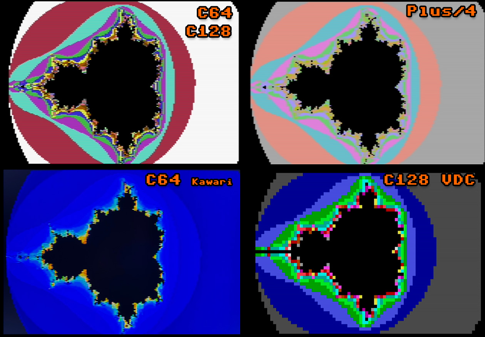

# mandelbr8
A fast Mandelbrot generator for 8 bit computers.
Currently supported:
- Commodore 64 (with or without Kawari acceleration).
- Commodore 128 (VIC-IIe and VDC modes).
- Commodore TED machines (Plus/4 and C16 with 64 KB).
- [more 8 bit machines in the future]

# CONTROLS

The app is simply controlled using a joystick:
- C64/C128: Joystick port 2.
- TED machines: Joystick port 1.

Actions:
- Up, Down, Left, Right: Move around in complex plane.
- Button + Up: Zoom in.
- Button + Down: Zoom out.
- Button + Right: Increment max iterations (upper limit of 255).
- Button + Left: Decrement max iterations (lower limit of 1).

Note: Zooming in over the precision limit can cause a solid color screen to be rendered. In that case, zoom out until you see the image rendered correctly again.

# SUPPORTED RESOLUTIONS
### C64, C128 40 column mode, TED machines
- First pass: 40x25, 16 colors
- Second pass: 160x200, 16 colors (multicolor bitmap)

### C128 80 column mode:
- First pass: 80x50, 16 colors
- Second pass: [not yet supported].  
Note: The 80x50 text mode is experimental and has not been tested on a CRT display.

# ALGORITHM

### Mandelbrot calculation
This is my fast fixed-point implementation of the Mandelbrot algorithm (see Wikipedia for details).  
Most 8-bit CPUs don't have integer multiplication instructions, let alone floating point ones, so we need a way to make calculation time much faster than a usual implentation.
The slow part of the core algorithm is the two squares and one multiplication per iteration.  
My algorithm solves this by using Q6.10 fixed-point integers instead of floats. A Q6.10 number uses 6 bits for the signed integer part, and 10 bits for the decimal part.  
This allows using fast 16x16 signed integer multiplication algorithms, and then adjust the result back to Q6.10.  
Before starting, the program creates a 32 KB table of 16384 Q5.9 unsigned numbers. This speeds up the calculation even more, as no multiplication is needed to square a number.  

If the Kawari chip is present, we use its hardware acceleration for 16x16 bit signed multiplication, which reduces calculation times by about 25%.

The rendering is done in two passes.

The first pass is low-resolution and serves two purposes:
- Quick preview of rendered image.
- Buffer iterations for second pass optimization.

The second pass is high resolution. Each low-resolution pixel in the first pass is either skipped (based on lo-res boundaries) or treated as a tile composed of high-resolution pixels which are calculated and then rendered.
The number of tile pixels varies depending on the high-res video mode. In Commodore multicolor bitmap mode, each tile is composed by 4x8 double-width pixels.

### Hi-res tile rendering

Most 8 bit machines have limitations on the number of colors that can be used in a 8x8 or 4x8 block.  

The VIC-II chip in the C64 and C128 only allows 4 colors for each 4x8 block in multicolor bitmap mode:
- 1 common background color, shared by all blocks. We use black (Mandelbrot set color).
- 3 custom colors.
- Each color is selected from a fixed palette of 16 colors. If the Kawari version of the VIC-II is found, we redefine the palette with a nice gradient.

The TED chip in the Plus/4 and C16 also allows only 4 colors for each 4x8 block in multicolor bitmap mode, but with further restrictions:
- 2 common background colors, shared by all blocks. We use Black (Mandelbrot set color) and Light Gray.
- 2 custom colors chosen from a fixed palette of 121 colors.  
We use pastel colors on the TED and use Light Gray as the second shared color to minimize the visibility of color errors.

After calculating all colors in the 4x8 tile, we create a color histogram and assign block colors based on the most used ones.  
Depending on the tile, some color artifacts might noticeable.

Note: The Kawari supports 320x200 in 16 colors without color clashes, but this mode is not yet supported.

# LICENSE

Creative Commons, CC BY

https://creativecommons.org/licenses/by/4.0/deed.en

Please add a link to this github project.
